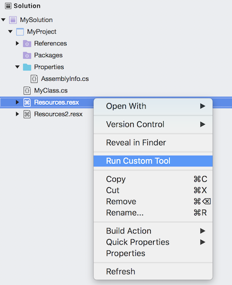
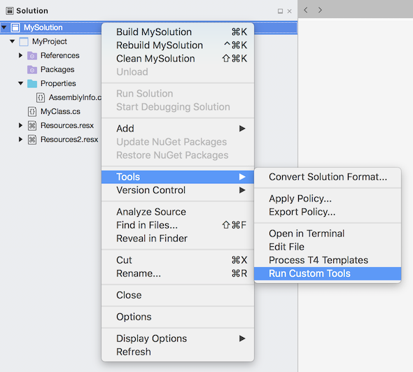
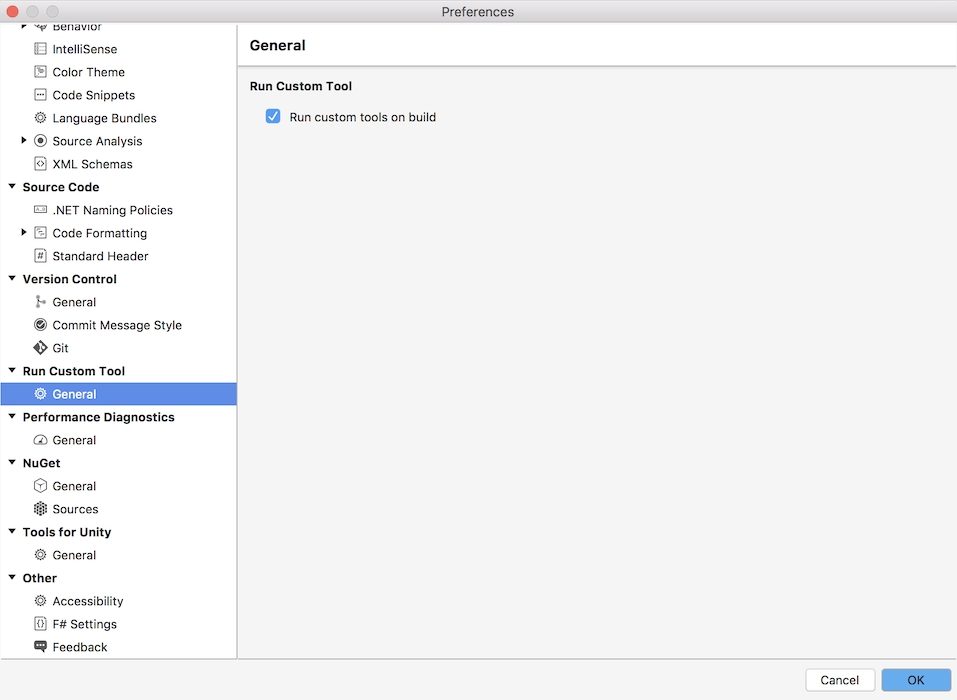

# Run Custom Tool

Extends custom tool support in MonoDevelop and Visual Studio.

## Features

 - Run custom tool for single file.
 - Run all custom tools for project or solution.
 - Run custom tools on building a project or solution

To run all the custom tools for a project or solution, open the Solution Window,
right click and select Tools - Run Custom Tools.

To run the custom tool for a single file, from the Solution window, right click
the file and select Run Custom Tool.

By default custom tools will be run when the project or solution is built. Only if the generated
file is missing or out of date will the custom tool be run. To enable or disable this feature
open preferences, select Run Custom Tool, and check or uncheck Run custom tools on build.

